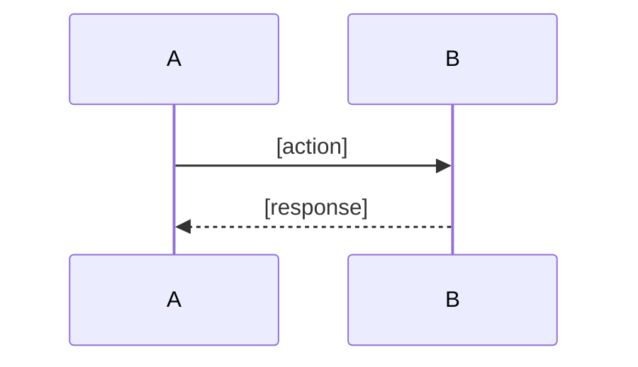

# Discovering Context

## Announcement (MANDATORY)

Before executing this skill, you MUST announce to the user:

「我将使用 **上下文探索** 技能来调查项目背景、理解现有状态和依赖关系。」

This creates a commitment checkpoint. Proceed only after announcing.

## Core Thinking

**Investigate** - Build cognitive model through systematic information collection.

**Recording**: Conversation output is invisible to users. You MUST record to workspace node. Standard: "If context is wiped now, can you recall discussion details from conclusion alone?"

**Progressive Recording**: For long explorations, NEVER wait until the end to record. After each major discovery, immediately `log_append` key findings. Context may be lost at any time.

## Typical Actions

- **Explore codebase**: Use Task tool with `subagent_type=Explore` for complex exploration
- Search code: Use Grep/Glob for targeted keyword search
- Read docs: Scan README, design docs, API docs
- Trace dependencies: Analyze module relationships, data flow

## When to Use Explore Agent

**PREFER Explore agent** for open-ended exploration:
- "Where is X implemented?"
- "How does the codebase handle Y?"
- "Find all files related to Z"

**Use Grep/Glob directly** for targeted search:
- Specific class/function name
- Known file pattern
- Simple keyword lookup

## Strategy Selection

### Macro (Document-first)
- **Use when**: New project, architecture design, requirements analysis
- **Sources**: README, docs/, architecture diagrams, CHANGELOG
- **Goal**: Understand overall design, business logic, module structure

### Micro (Code-first)
- **Use when**: Bug fixing, feature extension, code refactoring
- **Sources**: Source code, type definitions, test cases
- **Goal**: Understand implementation, data flow, call chains

**Decision rules**:
- Architecture design → Macro
- Specific implementation → Micro
- New domain → Macro first, then Micro deep dive
- Clear local scope → Micro first

## The Iron Law

```
THREE PHASES ARE NOT NEGOTIABLE:
  1. Broad Exploration  → Use Explore agent, build global view
  2. Deep Supplement    → Fill gaps between findings and requirements
  3. User Verification  → Present findings, get confirmation, reopen if needed

SKIP ANY PHASE = INCOMPLETE CONTEXT = WRONG IMPLEMENTATION
```

**No exceptions:**
- Don't "save time" by skipping broad exploration
- Don't assume deep supplement is unnecessary
- Don't proceed without user verification
- If intent gaps discovered → MUST reopen aligning-intent

## SOP

上下文探索分为三个阶段：**广度探索 → 深度补充 → 用户核对**

### 1. Broad Exploration (广度探索)

使用 Explore 子代理并行探索，快速建立全面认知。

**执行方式**:
```typescript
Task({
  subagent_type: "Explore",
  prompt: "探索 [具体范围]，关注 [关键点]...",
  description: "广度探索: [简述]"
})
```

**探索内容**（根据策略选择）:

| 策略 | 入口点 | 关注内容 |
|------|--------|----------|
| **Macro** | README, docs/, CHANGELOG | 架构设计、模块结构、业务逻辑 |
| **Micro** | src/index.*, types/, tests/ | 实现细节、类型定义、调用链 |

**⚠️ Checkpoint**: MUST `log_append` 广度探索结论（防止上下文丢失）

**Output**: 广度探索报告 + checkpoint 记录

### 2. Deep Supplement (深度补充)

分析"广度结论"与"当前需求"的差异，针对性收集缺失细节。

**执行流程**:
1. 对比广度探索结果与用户需求
2. 识别信息缺口（哪些问题还没回答）
3. 针对性深挖（直接 Read/Grep/LSP，不再用 Explore）

**深挖手段**:
- **依赖分析**: import/export 关系、核心 vs 辅助模块
- **数据流追踪**: 用户输入 → 模块处理 → 最终输出
- **类型理解**: 核心数据结构、接口定义

**Visualization rules**:
- Code investigation: **MUST** use mermaid sequenceDiagram
- Architecture overview: flowchart or simple `A → B → C`

**⚠️ Checkpoint**: `log_append` 补充的关键细节

**Output**: 补充细节列表 + 更新后的整体理解

### 3. User Verification (用户核对)

展示发现、确认理解、发现遗漏时触发回溯。

**展示内容**:
1. 完整的探索发现（使用 Output Template）
2. 与意图核对环节的关联点
3. 发现的技术约束/限制

**核对问题**:
- "这些发现是否覆盖了你关心的范围？"
- "有没有遗漏的技术约束需要补充？"
- "是否需要调整之前确定的需求范围？"

**根据用户反馈**:

| 用户反馈 | 后续动作 |
|----------|----------|
| 确认无误 | 继续后续流程 |
| 需要补充探索 | 回到步骤1或步骤2补充 |
| 发现意图遗漏 | **reopen** aligning-intent 节点补充 |

**Reopen 操作**:
```typescript
node_transition({
  nodeId: "aligning-intent-node-id",
  action: "reopen",
  reason: "上下文探索中发现遗漏的技术约束/需求点"
})
```

**Output**: 用户确认 or 回溯指令

### 4. Record to Workspace (MANDATORY)

After exploration, MUST record to workspace node.

**⚠️ notes vs log - Critical Distinction**:

| 字段 | 用途 | 持久性 | 内容 |
|------|------|--------|------|
| **notes** | 关键发现、过程记录 | **持久化** | 做了什么、发现什么、决策理由 |
| **log** | 临时 checkpoint | 临时 | 防止上下文丢失的快照 |
| **conclusion** | 最终结论 | 持久化 | 简洁总结 |
| **MEMO** | 详细内容 | 持久化 | >200 行的完整文档 |

**Core assumption**: 用户不看对话输出，只看工作台。**关键信息必须进 notes，不能只靠 log**。

**Recording locations**:
| Content | Location | Tool |
|---------|----------|------|
| Key conclusions (brief) | conclusion | node_update |
| Process + findings + decisions | **notes** | node_update |
| Full knowledge snapshot (>200 lines) | MEMO | memo_create + node_reference |

**NEVER hardcode MEMO IDs** in text like "见 MEMO#xxx". Use `node_reference` to link.

**Reference rules** (investigation tasks MUST include):
- Key files: `file:line` format
- Entry points: exact location
- Dependencies: module names with paths
- Core principle: references enable traceability, not bureaucracy

**Conclusion template** (brief, 3-5 lines):
```
**结果**: [一句话总结关键发现]
**范围**: [探索了什么]
**待确认**: [如有]
```

**Notes template** (detailed, 记录过程):
```
**Strategy**: Macro/Micro
**Phase 1 - Broad Exploration**:
- 扫描范围: [directories/files]
- 关键发现: [what was discovered]

**Phase 2 - Deep Supplement**:
- 信息缺口: [what was missing]
- 补充内容: [what was filled]

**Key Files**:
- Entry: file:line - [作用说明]
- Types: file - [作用说明]

**Dependencies**: [module relationships]
**Data Flow**: [brief or mermaid reference]
**Decisions**: [决策点和理由]
**Uncertainties**: [待确认项]
```

**Output**: node_update called with conclusion + notes

### 6. Present to User (MANDATORY)

After recording, MUST present findings to user:

1. **Output summary**: Show key findings using Output Template
2. **Wait for confirmation**: Ask user if findings are correct/complete
3. **NEVER proceed directly**: Do NOT start execution without user acknowledgment

**Output**: Summary presented, user confirmation received

## Information Source Priority

1. **Codebase**: Most reliable, implementation is truth
2. **Docs**: Official documentation, design docs
3. **User**: Confirm requirements and expectations
4. **Public Knowledge**: Tech docs, best practices

**Rules**:
- Code conflicts with docs → Trust code
- Docs missing → Check code first, then ask user
- Uncertain → Mark as "to be confirmed"

## Output Template

```markdown
### Discovery Summary
**Scope**: [What was explored]
**Strategy**: Macro / Micro

### Key Files
| Role | File | Description |
|------|------|-------------|
| Entry | file:line | [description] |
| Types | file | [description] |
| Config | file | [description] |

### Dependencies
- **Internal**: [module relationships]
- **External**: [key libraries]

### Data Flow
[Visualize with mermaid sequenceDiagram or flowchart]



### Findings
- [Key finding 1]
- [Key finding 2]

### Uncertainties
- [ ] [Item needing confirmation]
```

## Checklist

### Macro
- [ ] Project overview understood
- [ ] Tech stack identified
- [ ] Module structure mapped
- [ ] Data flow documented
- [ ] Config/deployment understood

### Micro
- [ ] Entry point located
- [ ] Key functions identified
- [ ] Type definitions understood
- [ ] Dependencies traced
- [ ] Data flow traced
- [ ] Error handling identified

### Three-Phase Flow
- [ ] **Broad exploration**: Used Explore agent, logged conclusions
- [ ] **Deep supplement**: Identified gaps, targeted deep-dive
- [ ] **User verification**: Presented findings, got confirmation
- [ ] **Reopen if needed**: Intent gaps → reopen aligning-intent

### Recording (MANDATORY)
- [ ] **Conclusion written**: Brief summary in node conclusion
- [ ] **Notes written**: Scope, key files, dependencies in node notes
- [ ] **MEMO linked**: Long content in MEMO, linked via node_reference (not hardcoded ID)
- [ ] **Wipe test**: If context wiped now, can recall details from recorded content?

### Long Content Protection
- [ ] **Progressive recording**: Used `log_append` after each major discovery
- [ ] **References complete**: All key files have `file:line` references
- [ ] **Checkpoints hit**: Logged after phase 1 and phase 2
- [ ] **Output Template complete**: Every section filled, no placeholders left

## Red Flags

| Thought | Reality |
|---------|---------|
| "I'll just grep directly, no need for Explore" | Broad exploration prevents missing global context. Use Explore first. |
| "I found enough info, skip to verification" | Deep supplement fills gaps between findings and requirements. Don't skip. |
| "Exploration done, let's start implementing" | User verification is MANDATORY. Present findings, wait for confirmation. |
| "Intent seems clear, no need to reopen" | If you discover gaps, you MUST reopen. Forcing ahead causes rework. |
| "I'll record everything at the end" | Progressive recording prevents context loss. Log after each phase. |
| "The file name is enough context" | References MUST include `file:line`. Vague locations are useless. |
| "Notes are redundant, log is enough" | Log is temporary. Key findings MUST go to notes for persistence. |
| "Code-first is always faster" | Strategy depends on task. Architecture → Macro, Implementation → Micro. |

## Mandatory Rules

1. **MUST follow three phases** - Broad → Deep → Verify, no skipping
2. **MUST use Explore in phase 1** - Broad exploration requires Explore subagent
3. **MUST checkpoint each phase** - `log_append` after each phase completion
4. **MUST present before proceed** - After exploration, NEVER proceed without user confirmation
5. **MUST reopen when needed** - Discover intent gaps → reopen aligning-intent, don't force continue
6. **MUST trust code over docs** - When docs conflict with code, code is truth
7. **MUST record findings** - Exploration without documentation is wasted effort

## Anti-Patterns

| Pattern | Wrong | Right |
|---------|-------|-------|
| **Blind start** | Code without reading existing code | Grep/Glob to locate relevant code first |
| **Over-explore** | Read entire project | Scope to task needs |
| **Trust docs over code** | Docs say X exists, believe it | Code is truth, docs may be stale |
| **No record** | Explore and forget | Output structured knowledge snapshot |

## Common Rationalizations

| Excuse | Why Wrong | Correct Action |
|--------|-----------|----------------|
| "I'll figure it out as I code" | Leads to wrong assumptions and rework | Explore first, code informed |
| "The docs explain everything" | Docs are often outdated or incomplete | Verify against actual code |
| "I've worked on similar projects" | This project may have different patterns | Check this specific codebase |
| "Exploration takes too long" | Coding without context takes longer | 20 min exploration saves hours |
| "I'll just ask if I get stuck" | User may not know implementation details | Code is the authoritative source |
