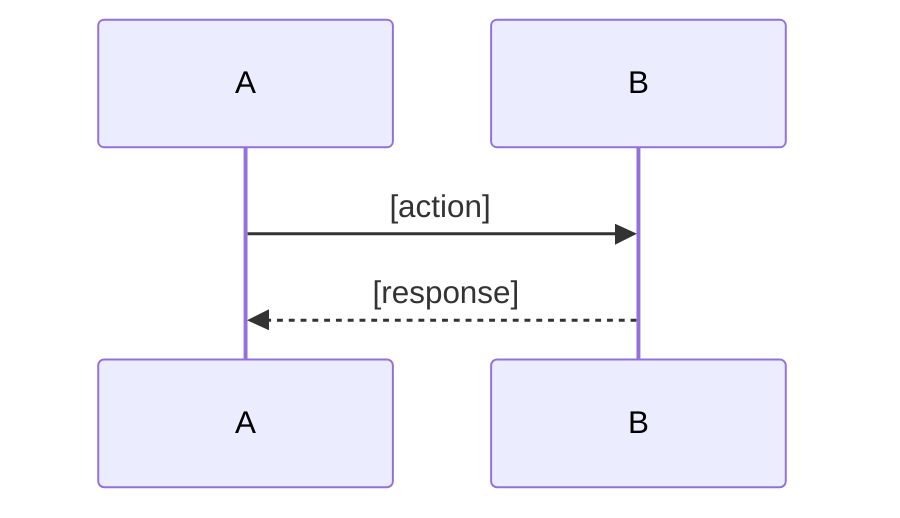

# Discovering Context

## Core Thinking

**Investigate** - Build cognitive model through systematic information collection.

**Recording**: Conversation output is invisible to users. You MUST record to workspace node. Standard: "If context is wiped now, can you recall discussion details from conclusion alone?"

**Progressive Recording**: For long explorations, NEVER wait until the end to record. After each major discovery, immediately `log_append` key findings. Context may be lost at any time.

## Typical Actions

- **Explore codebase**: Use Task tool with `subagent_type=Explore` for complex exploration
- Search code: Use Grep/Glob for targeted keyword search
- Read docs: Scan README, design docs, API docs
- Trace dependencies: Analyze module relationships, data flow

## When to Use Explore Agent

**PREFER Explore agent** for open-ended exploration:
- "Where is X implemented?"
- "How does the codebase handle Y?"
- "Find all files related to Z"

**Use Grep/Glob directly** for targeted search:
- Specific class/function name
- Known file pattern
- Simple keyword lookup

## Strategy Selection

### Macro (Document-first)
- **Use when**: New project, architecture design, requirements analysis
- **Sources**: README, docs/, architecture diagrams, CHANGELOG
- **Goal**: Understand overall design, business logic, module structure

### Micro (Code-first)
- **Use when**: Bug fixing, feature extension, code refactoring
- **Sources**: Source code, type definitions, test cases
- **Goal**: Understand implementation, data flow, call chains

**Decision rules**:
- Architecture design → Macro
- Specific implementation → Micro
- New domain → Macro first, then Micro deep dive
- Clear local scope → Micro first

## SOP

### 1. Entry Point Location

**Macro entries**:
1. Project root README.md
2. docs/ directory
3. package.json / pyproject.toml
4. CHANGELOG.md

**Micro entries**:
1. Grep for keywords
2. src/index.* or main.*
3. Type definitions (src/types/)
4. Test files

### 2. Dependency Analysis

**Module dependencies**:
- Analyze import/export relationships
- Identify core vs auxiliary modules
- Build mental dependency graph

**External dependencies**:
- Extract production vs dev dependencies
- Identify core libraries and their purpose
- Note version constraints

**Data dependencies**:
- Identify shared data structures
- Trace data flow paths
- Understand state management

**⚠️ Checkpoint**: After completing dependency analysis, `log_append` key module relationships before proceeding.

### 3. Data Flow Tracing

**For functional tasks**:
- Start from user input
- Track through modules
- Identify transformations
- Locate final output

**For system tasks**:
- Identify core data structures
- Understand persistence
- Analyze sync mechanisms
- Trace config propagation

**Visualization rules**:
- Code investigation: **MUST** use mermaid sequenceDiagram
- Architecture overview: flowchart or simple `A → B → C`

**⚠️ Checkpoint**: After tracing data flow, `log_append` the flow diagram before proceeding.

### 4. Output Knowledge Snapshot

Structure findings using output template.

### 5. Record to Workspace (MANDATORY)

After exploration, MUST record to workspace node:

**Recording locations**:
| Content | Location | Tool |
|---------|----------|------|
| Key conclusions (brief) | conclusion | node_update |
| Scope, key files, dependencies | notes | node_update |
| Full knowledge snapshot (>200 lines) | MEMO | memo_create + node_reference |

**NEVER hardcode MEMO IDs** in text like "见 MEMO#xxx". Use `node_reference` to link.

**Reference rules** (investigation tasks MUST include):
- Key files: `file:line` format
- Entry points: exact location
- Dependencies: module names with paths
- Core principle: references enable traceability, not bureaucracy

**Conclusion template** (brief):
```
[探索范围] + [关键发现] + [待确认项]
```

**Notes template** (detailed):
```
**Strategy**: Macro/Micro
**Scanned**: [directories/files]
**Key Files**:
- Entry: file:line
- Types: file
**Dependencies**: [list]
**Data Flow**: [brief]
**Uncertainties**: [items]
```

**Output**: node_update called with conclusion + notes

### 6. Present to User (MANDATORY)

After recording, MUST present findings to user:

1. **Output summary**: Show key findings using Output Template
2. **Wait for confirmation**: Ask user if findings are correct/complete
3. **NEVER proceed directly**: Do NOT start execution without user acknowledgment

**Output**: Summary presented, user confirmation received

## Information Source Priority

1. **Codebase**: Most reliable, implementation is truth
2. **Docs**: Official documentation, design docs
3. **User**: Confirm requirements and expectations
4. **Public Knowledge**: Tech docs, best practices

**Rules**:
- Code conflicts with docs → Trust code
- Docs missing → Check code first, then ask user
- Uncertain → Mark as "to be confirmed"

## Output Template

```markdown
### Discovery Summary
**Scope**: [What was explored]
**Strategy**: Macro / Micro

### Key Files
| Role | File | Description |
|------|------|-------------|
| Entry | file:line | [description] |
| Types | file | [description] |
| Config | file | [description] |

### Dependencies
- **Internal**: [module relationships]
- **External**: [key libraries]

### Data Flow
[Visualize with mermaid sequenceDiagram or flowchart]



### Findings
- [Key finding 1]
- [Key finding 2]

### Uncertainties
- [ ] [Item needing confirmation]
```

## Checklist

### Macro
- [ ] Project overview understood
- [ ] Tech stack identified
- [ ] Module structure mapped
- [ ] Data flow documented
- [ ] Config/deployment understood

### Micro
- [ ] Entry point located
- [ ] Key functions identified
- [ ] Type definitions understood
- [ ] Dependencies traced
- [ ] Data flow traced
- [ ] Error handling identified

### Recording (MANDATORY)
- [ ] **Conclusion written**: Brief summary in node conclusion
- [ ] **Notes written**: Scope, key files, dependencies in node notes
- [ ] **MEMO linked**: Long content in MEMO, linked via node_reference (not hardcoded ID)
- [ ] **Wipe test**: If context wiped now, can recall details from recorded content?

### Long Content Protection
- [ ] **Progressive recording**: Used `log_append` after each major discovery
- [ ] **References complete**: All key files have `file:line` references
- [ ] **Checkpoints hit**: Logged after dependency analysis and data flow tracing
- [ ] **Output Template complete**: Every section filled, no placeholders left

## Red Flags

1. **Skip exploration** - Start implementing without reading existing code
2. **Assume existence** - Assume feature exists without verification
3. **Ignore dependencies** - Don't check module relationships
4. **Wrong strategy** - Use docs when should use code, or vice versa
5. **Silent execution** - Complete exploration, then immediately start implementing without showing user
6. **Batch recording** - Explore for 30+ minutes without any `log_append`
7. **Missing references** - Conclusions without `file:line` references
8. **Skip checkpoints** - Complete long exploration without intermediate logs

## Mandatory Rules

1. **MUST explore before implementing** - NEVER code without understanding existing patterns
2. **MUST verify existence** - NEVER assume feature/module exists, check code
3. **MUST trust code over docs** - When docs conflict with code, code is truth
4. **MUST record findings** - Exploration without documentation is wasted effort
5. **MUST scope exploration** - Explore what's needed, not the entire project
6. **MUST present before proceed** - After exploration, NEVER start execution directly. Present findings, wait for user confirmation

## Anti-Patterns

| Pattern | Wrong | Right |
|---------|-------|-------|
| **Blind start** | Code without reading existing code | Grep/Glob to locate relevant code first |
| **Over-explore** | Read entire project | Scope to task needs |
| **Trust docs over code** | Docs say X exists, believe it | Code is truth, docs may be stale |
| **No record** | Explore and forget | Output structured knowledge snapshot |

## Common Rationalizations

| Excuse | Why Wrong | Correct Action |
|--------|-----------|----------------|
| "I'll figure it out as I code" | Leads to wrong assumptions and rework | Explore first, code informed |
| "The docs explain everything" | Docs are often outdated or incomplete | Verify against actual code |
| "I've worked on similar projects" | This project may have different patterns | Check this specific codebase |
| "Exploration takes too long" | Coding without context takes longer | 20 min exploration saves hours |
| "I'll just ask if I get stuck" | User may not know implementation details | Code is the authoritative source |
